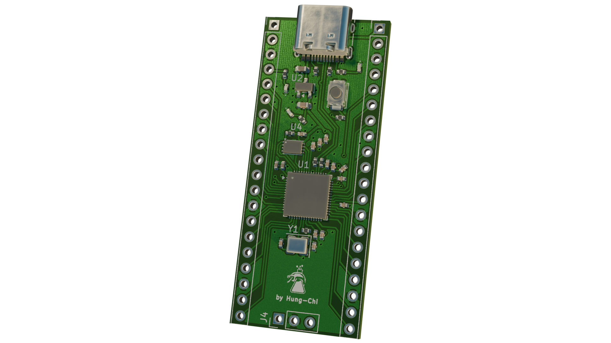
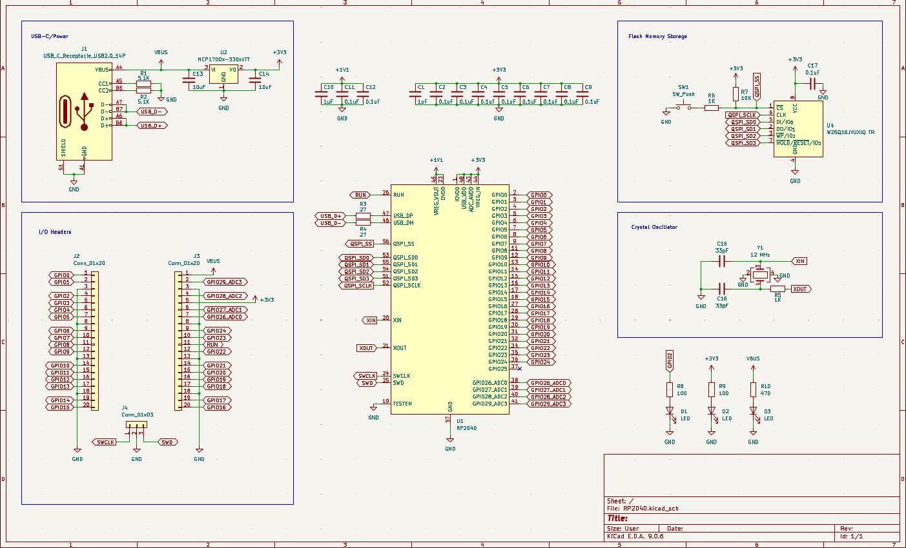
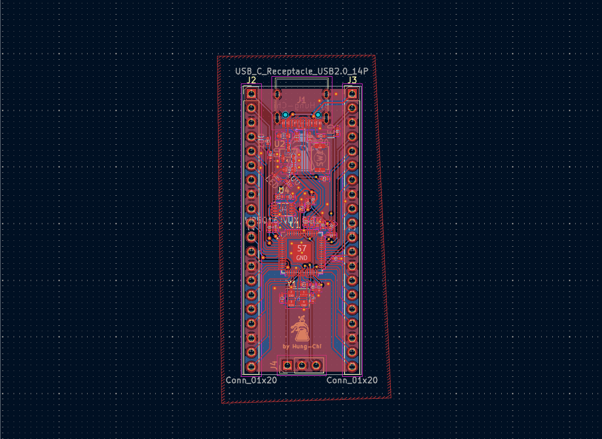
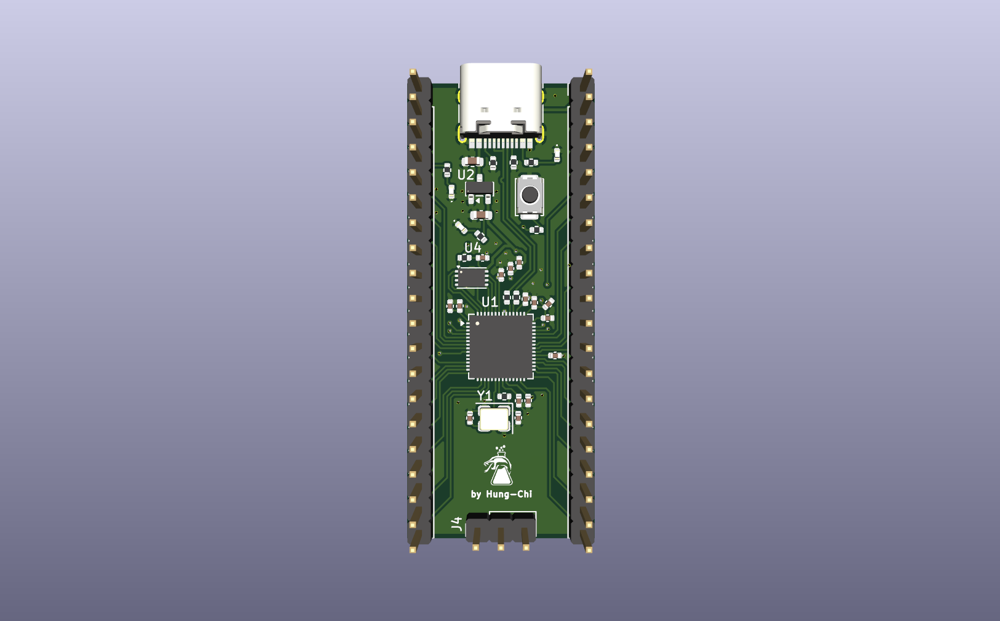
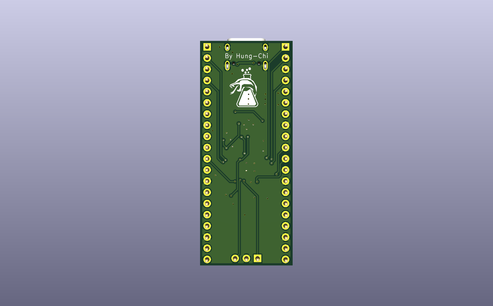

# RP2040 Hacker Board
This is my very first RP2040 dev-board, and this is huge for the following reasons:
- I will be able to integrate the chip directly into my future design
- I will learn many fundamental concepts essential to pcb design

## Images

## How to replicate
Simply download the repo
- For schematic: .kicad_sch
- For PCB Design: .kicad_pcb
- For the entire project: .kicad_pro

## Conclusion
There was a very huge gap between macropad and a custom dev-board, so I stuggled a lot with designing schematic and wiring the PCB. But overall, I'm really proud of myself and I'm finally confident enough to build more and more custom boards using integrated RP2040 rather than always relying on Raspberry Pi!
